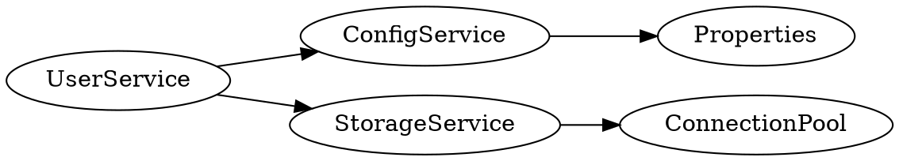

# Glue Framework Evolution Plan

## Executive Summary

This plan transforms Glue from a competent Spring-inspired DI framework into the most feature-rich
and performant runtime DI framework for Go. It addresses every major gap relative to Google Wire,
Uber Dig/Fx, samber/do, and Spring Framework while preserving Glue's core identity: struct-tag-driven,
reflection-based, Spring-like DI for Go.

The plan is organized into 7 phases, ordered by dependency and impact. Each phase is self-contained
and delivers independently valuable improvements.

---

## Phase 1: Performance & Caching (Eliminate O(n*m))

**Goal:** Cache injection resolution steps so repeated context creation and runtime injection
are near-instant. This is the foundation that makes everything else faster.

### 1.1 Injection Plan Cache

**Problem:** Every call to `createContext` iterates all beans against all interfaces — O(n*m).
The `investigate()` function re-parses struct tags via reflection on every context creation.

**Solution:** Introduce an `injectionPlan` that caches the pre-computed injection steps.

```
// New file: plan.go

// injectionPlan caches the parsed struct tag metadata for a given Go type.
// Safe for concurrent use. Populated once per unique reflect.Type.
type injectionPlan struct {
    classPtr        reflect.Type
    anonymousFields []reflect.Type
    fields          []*injectionDef
    properties      []*propInjectionDef
}

// Global cache: reflect.Type -> *injectionPlan
// Uses sync.Map for lock-free reads after initial population.
var globalPlanCache sync.Map
```

**Changes:**
- `bean.go:investigate()` — check `globalPlanCache` first; only reflect-parse on cache miss
- `context.go:createContext()` — replace the O(n*m) interface scan with a two-phase approach:
  1. **Registration phase:** Register all beans by their concrete type (O(n))
  2. **Resolution phase:** For each injection point, lookup candidates from a pre-built
     type-to-beans index. Build an `interfaceIndex map[reflect.Type][]*bean` once, then
     each injection point does O(1) lookup instead of scanning all beans.
- `context.go:Inject()` — already uses `sync.Map` cache (`runtimeCache`), refactor to share
  the same `injectionPlan` cache

**Complexity reduction:**
- Context creation: O(n*m) -> O(n + k) where k = number of injection points
- Runtime injection: Already O(1) amortized via `runtimeCache`, but unify the cache

**Files to modify:** `bean.go`, `context.go`
**New files:** `plan.go`

### 1.2 Interface Implementation Index

**Problem:** `searchInterfaceCandidates` iterates all core beans checking `implements()` for
each interface type. This is the inner loop of the O(n*m) problem.

**Solution:** Build a `map[reflect.Type][]*bean` index (interface type -> implementing beans)
once during context creation, immediately after all beans are registered.

```
// In context struct, add:
interfaceIndex map[reflect.Type][]*bean  // built once after scan phase
```

**Algorithm:**
1. After all beans are scanned into `core`, iterate each bean once
2. For each bean, check all known interface types (collected from injection points)
3. Store matches in `interfaceIndex`
4. All subsequent lookups use the index

**Files to modify:** `context.go`

### 1.3 Property Resolution Cache

**Problem:** Every `properties.Get(key)` iterates through the resolver chain. For dynamic
config this is correct, but for static properties it's wasteful.

**Solution:** Add a two-tier cache:
- **Static tier:** Properties from files/maps — cached after initial load
- **Dynamic tier:** Properties from `PropertyResolver` implementations — always resolved fresh

```
// In properties struct, add:
staticCache  map[string]string  // populated from file/map sources
dynamicKeys  map[string]bool    // keys known to come from dynamic resolvers
```

**Cache invalidation:** When `Set()` or `LoadMap()` is called, update `staticCache`.
When a `PropertyResolver` is registered, mark its keys as dynamic (or mark all keys
as potentially dynamic if the resolver doesn't declare its key space).

**Design choice:** For Phase 4 (dynamic config), the cache must support invalidation.
Use `atomic.Value` for the static cache to enable lock-free reads.

**Files to modify:** `properties.go`

---

## Phase 2: Dynamic Config & Function Value Injection

**Goal:** Support refreshable properties that automatically propagate changes to beans,
and inject property values via functions for lazy/dynamic access.

### 2.1 Function Injection for `value` Tag

**Problem:** Currently `value:"app.port"` injects a static string/int/bool at construction
time. There is no way to get a dynamically-refreshing property value.

**Solution:** Support function-typed fields in the `value` tag. When the field type is a
function returning a value, inject a closure that resolves the property on each call.

```go
type myService struct {
    // Static (existing behavior, unchanged):
    Port int `value:"app.port, default=8080"`

    // Dynamic (NEW — function injection):
    Secret func() string `value:"db.password"`

    // Dynamic with type conversion:
    MaxRetries func() int `value:"app.max_retries, default=3"`

    // Dynamic with error:
    ConnString func() (string, error) `value:"db.connection_string"`
}
```

**Implementation:**

In `bean.go:investigate()`, when parsing `value` tags:
- If `field.Type.Kind() == reflect.Func`, validate the function signature:
  - `func() T` — returns value, panics if property missing and no default
  - `func() (T, error)` — returns value + error if property missing
  - `func() (T, bool)` — returns value + found flag
- Store a `dynamic: true` flag on the `propInjectionDef`

In `injection.go:propInjectionDef.inject()`:
- If dynamic, create a closure that captures `properties` reference and `propertyName`
- The closure calls `properties.Get(key)` + type conversion on each invocation
- Set the closure as the field value

```go
// Example generated closure for func() string:
field.Set(reflect.ValueOf(func() string {
    if val, ok := properties.Get(propertyName); ok {
        return val
    }
    return defaultValue
}))

// Example for func() (string, error):
field.Set(reflect.ValueOf(func() (string, error) {
    if val, ok := properties.Get(propertyName); ok {
        return val, nil
    }
    if hasDefault {
        return defaultValue, nil
    }
    return "", fmt.Errorf("property '%s' not found", propertyName)
}))
```

**Why this design:**
- Zero overhead for static properties (existing behavior unchanged)
- Dynamic properties pay cost only when accessed (lazy)
- Compatible with PropertyResolver chain — if an AWS Secrets Manager resolver
  updates, the next `func()` call returns the new value
- No magic proxy objects or reflection at call time — just a Go closure
- Type-safe at the call site

**Files to modify:** `bean.go`, `injection.go`
**Tests:** `dynamic_property_test.go`

### 2.2 PropertyWatcher Interface

**Problem:** There is no way to be notified when a property changes. Cloud secret rotation
(AWS Secrets Manager, GCP Secret Manager, Vault) requires periodic refresh and notification.

**Solution:** Add an optional `PropertyWatcher` interface that `PropertyResolver` implementations
can also implement.

```go
// api.go — new interfaces

// PropertyWatcher is optionally implemented by PropertyResolver to support
// dynamic config. The Properties system calls Watch() once during registration.
// The watcher should call onChange when any property it manages changes.
type PropertyWatcher interface {
    Watch(onChange func(keys []string)) error
    Unwatch() error
}

// RefreshableBean is optionally implemented by beans that need to react
// to property changes. Called when any of the bean's value-tagged properties change.
type RefreshableBean interface {
    OnRefresh(changedKeys []string) error
}
```

**Flow:**
1. When a `PropertyResolver` is registered and also implements `PropertyWatcher`,
   call `Watch(onChange)` with a callback
2. When `onChange` fires with changed keys, the `Properties` system:
   a. Invalidates the static cache for those keys
   b. For each bean that has `value` tags referencing changed keys:
      - If the field is a function (`func() T`), no action needed — next call reads fresh value
      - If the field is a static value AND the bean implements `RefreshableBean`,
        re-inject the property and call `OnRefresh(changedKeys)`
      - If the field is static and bean does NOT implement `RefreshableBean`, log a warning

**Why not auto-re-inject static values?** Re-injecting a static `int` field on a struct
while other goroutines read it is a data race. The function approach (`func() int`) is
inherently safe. `RefreshableBean` is an opt-in for beans that handle their own synchronization.

**Tracking property-to-bean mapping:**
```go
// In context struct, add:
propertyBeanMap map[string][]*bean  // property key -> beans that use it
```

Built during `constructBean` when property injection happens.

**Files to modify:** `api.go`, `properties.go`, `context.go`
**New files:** `watcher.go`
**Tests:** `watcher_test.go`

### 2.3 Built-in Environment PropertyResolver

**Problem:** The user mentions having a custom env var resolver outside Glue. This should
be a built-in, since environment variables are the most common external config source.

**Solution:** Add `EnvPropertyResolver` as a built-in optional resolver.

```go
// New file: env.go

// EnvPropertyResolver resolves properties from OS environment variables.
// Property keys are converted to env var names: "app.db.host" -> "APP_DB_HOST"
// Prefix can filter env vars: prefix "MYAPP" matches "MYAPP_DB_HOST" for key "db.host"
type EnvPropertyResolver struct {
    Prefix   string
    Priority int  // default: 200 (higher than file-based properties at 100)
}
```

**Key mapping strategy (configurable):**
- Default: `app.db.host` -> `APP_DB_HOST` (dots to underscores, uppercase)
- With prefix "MYAPP": `db.host` -> `MYAPP_DB_HOST`
- Custom mapper function for advanced cases

**Files:** `env.go`, `env_test.go`

### 2.4 Property Templates (Expression Support)

**Problem:** Property values cannot reference other properties. No expression support.

**Solution:** Add `${key}` placeholder resolution within property values, evaluated at
`Get()` time.

```properties
app.name = myapp
app.log.dir = /var/log/${app.name}
app.version = ${APP_VERSION:1.0.0}    # with default after colon
```

**Implementation:** In `properties.Get()`, after resolving the raw value, scan for `${...}`
patterns and recursively resolve. Cache resolved values (invalidate on property change).

**Circular reference detection:** Track resolution stack, error on cycle.

**Syntax:**
- `${key}` — resolve property, error if missing
- `${key:default}` — resolve property, use default if missing
- Nested: `${${env}.db.host}` — resolve inner first (limited depth)

**Files to modify:** `properties.go`
**Tests:** `template_test.go`

---

## Phase 3: Profiles & Conditional Beans

**Goal:** Support Spring-like profiles for conditional bean registration based on
environment (dev/staging/prod/test).

### 3.1 Profile System

**Design:**

```go
// api.go — new interfaces

// ProfileBean is implemented by beans that should only be registered
// when specific profiles are active.
type ProfileBean interface {
    BeanProfile() string  // e.g., "dev", "!prod", "dev|staging"
}
```

**Profile activation:**
- Environment variable: `GLUE_PROFILES_ACTIVE=dev,local`
- Programmatic: `glue.NewWithProfiles([]string{"dev"}, beans...)`
- Property: `glue.profiles.active=dev,local`

**Profile expression syntax:**
- `"dev"` — active when "dev" profile is active
- `"!prod"` — active when "prod" profile is NOT active
- `"dev|staging"` — active when either "dev" or "staging" is active
- `"dev&local"` — active when both "dev" and "local" are active

**Implementation:**

In `context.go:forEach()`, after checking for `Scanner`:
```go
case ProfileBean:
    if !ctx.isProfileActive(instance.BeanProfile()) {
        continue  // skip this bean
    }
```

**Scanner + Profile interaction:** If a `Scanner` itself implements `ProfileBean`,
skip all its beans. Individual beans returned by `ScannerBeans()` can also implement
`ProfileBean` for fine-grained control.

**Build tag integration:** Document the pattern of using Go build tags alongside profiles:
```go
//go:build dev

package myapp

type devScanner struct{}
func (s *devScanner) ScannerBeans() []interface{} { ... }
func (s *devScanner) BeanProfile() string { return "dev" }
```

**Files to modify:** `api.go`, `context.go`
**New files:** `profile.go`, `profile_test.go`

### 3.2 Conditional Bean Registration

**Problem:** Beyond profiles, sometimes you want beans registered based on arbitrary
conditions (e.g., "only if Redis is available", "only if another bean exists").

**Solution:** Add a `ConditionalBean` interface for advanced cases.

```go
// ConditionalBean is optionally implemented by beans. If Condition() returns false,
// the bean is not registered in the context.
type ConditionalBean interface {
    Condition() bool
}
```

**Ordering:** `ProfileBean` is checked first (cheap string match), then `ConditionalBean`
(may do I/O or complex logic). Both can be implemented on the same bean.

**Files to modify:** `api.go`, `context.go`
**Tests:** `conditional_test.go`

---

## Phase 4: Bean Scopes

**Goal:** Support prototype (transient), request, and custom scopes beyond singleton.

### 4.1 Scope System

**Current state:** All beans are singletons. `FactoryBean` with `Singleton() == false`
is the only way to get multiple instances, but it's limited to factory-produced beans.

**Design:**

```go
// api.go — new types

type BeanScope string

const (
    Singleton BeanScope = "singleton"  // default, one instance per context
    Prototype BeanScope = "prototype"  // new instance per injection point
    Request   BeanScope = "request"    // new instance per RequestScope.Enter()
)

// ScopedBean is optionally implemented to declare bean scope.
type ScopedBean interface {
    BeanScope() BeanScope
}
```

**Tag syntax alternative:**
```go
type myHandler struct {
    Processor *requestProcessor `inject:"scope=request"`
}
```

### 4.2 Prototype Scope

**Behavior:** A new instance is created for every injection point. Each injection gets
its own copy. The prototype bean's `PostConstruct` is called for each instance.

**Implementation:**
- During injection, if the candidate bean has prototype scope:
  - Deep-copy the bean definition (struct tag metadata is shared/cached)
  - Allocate a new instance of the concrete type via `reflect.New()`
  - Inject dependencies into the new instance
  - Call `PostConstruct` if applicable
  - Set the new instance as the field value
  - Register for `Destroy` on context close

**FactoryBean integration:** `FactoryBean` with `Singleton() == false` already produces
multiple instances. Prototype scope generalizes this to any bean.

### 4.3 Request Scope

**Problem:** Web applications need per-request bean instances (e.g., request-scoped
database transactions, user context, request loggers).

**Design:**

```go
// api.go — new interface

// RequestScope manages the lifecycle of request-scoped beans.
type RequestScope interface {
    // Enter creates a new request scope and returns a scoped context.
    // All request-scoped bean injections within this scope share instances.
    Enter() (ScopedContext, error)
}

// ScopedContext represents an active request scope.
type ScopedContext interface {
    Context  // embeds the full Context interface

    // Exit destroys all request-scoped beans in this scope.
    Exit() error
}
```

**Usage pattern:**
```go
func httpHandler(w http.ResponseWriter, r *http.Request) {
    scopedCtx, _ := requestScope.Enter()
    defer scopedCtx.Exit()

    // Inject request-scoped beans
    var handler requestHandler
    scopedCtx.Inject(&handler)
    handler.Handle(w, r)
}
```

**Implementation:**
- `RequestScope` is a special bean auto-registered in every context
- `Enter()` creates a lightweight child context with request-scoped bean storage
- Request-scoped beans are stored in a `map[reflect.Type]interface{}` on the scoped context
- First injection of a request-scoped type allocates it; subsequent injections reuse
- `Exit()` calls `Destroy()` on all request-scoped beans in reverse order

**Files:** `scope.go`, `scope_test.go`

### 4.4 Custom Scopes

```go
// CustomScope allows users to define their own bean scopes.
type CustomScope interface {
    Name() string
    Get(beanType reflect.Type, factory func() (interface{}, error)) (interface{}, error)
    Remove(beanType reflect.Type)
    Destroy() error
}
```

Users register custom scopes: `glue.RegisterScope("session", &sessionScope{})`

---

## Phase 5: Type Safety & API Modernization

**Goal:** Eliminate `interface{}` where possible, modernize the API with Go generics,
simplify syntax, and improve naming.

### 5.1 Generics Wrapper API (Go 1.18+)

**Strategy:** Keep the existing reflection-based core (it must use `interface{}`/`any`
internally). Add a generics-based wrapper package that provides type-safe access.

```go
// New package: glue/typed (or top-level functions with generics)

// Type-safe bean lookup
func Bean[T any](ctx Context) (T, error)
func MustBean[T any](ctx Context) T
func Beans[T any](ctx Context) []T

// Type-safe property access
func Property[T any](ctx Context, key string) (T, error)
func PropertyOr[T any](ctx Context, key string, def T) T

// Type-safe factory
func Provide[T any](factory func() (T, error)) FactoryBean
```

**Usage:**
```go
userService := glue.MustBean[UserService](ctx)
port := glue.PropertyOr[int](ctx, "app.port", 8080)
```

**Backward compatibility:** The existing `interface{}`-based API remains unchanged.
The generics API wraps it. Users on Go <1.18 continue using the old API.

**Build constraint:** `//go:build go1.18`

**Files:** `typed.go` (build-tagged for go1.18+), `typed_test.go`

### 5.2 Update Go Module to 1.18+

**Current:** `go 1.17` in go.mod.

**Change:** Bump to `go 1.18` minimum. This is a breaking change for users on Go 1.17,
but Go 1.17 is well past end-of-life (EOL was August 2023).

**Rationale:** Enables generics, `any` alias for `interface{}`, and other language improvements.
All competitors except Facebook Inject already require 1.18+.

### 5.3 Replace `interface{}` with `any`

**Mechanical change:** Replace all `interface{}` with `any` throughout the codebase.
This is purely cosmetic in Go 1.18+ but signals modernity.

**Files:** All `.go` files.

### 5.4 Syntax Simplification & Naming Improvements

**Current tag syntax issues:**
- `inject:""` requires empty string — looks like a mistake
- `inject:"bean=qualifier"` — verbose for common operation
- `inject:"optional,lazy,bean=name,level=2"` — long and hard to read
- `value:"key, default=val"` — space after comma can cause issues

**Proposed changes (backward compatible — old syntax still works):**

| Current | New (also accepted) | Notes |
|---------|-------------------|-------|
| `inject:""` | `inject:"*"` or just `inject` (bare tag) | `*` = auto-match |
| `inject:"bean=myService"` | `inject:"@myService"` | `@` prefix = qualifier |
| `inject:"optional"` | `inject:"?"` | Common shorthand |
| `inject:"lazy"` | `inject:"~"` | Tilde = lazy |
| `inject:"optional,lazy,bean=name"` | `inject:"?~@name"` | Combinable |
| `value:"key,default=val"` | `value:"key=val"` | Simpler default syntax |

**Implementation:** In `bean.go:investigate()`, parse both old and new syntax. The new
symbols are parsed first; if not found, fall back to the existing comma-separated parser.

**Tag parsing rules for new syntax:**
```
inject:"<modifiers><qualifier>"
  modifiers: ? = optional, ~ = lazy, * = auto (default)
  qualifier: @name = specific bean name
  level:     ^N = level (^0 default, ^1 current only, ^-1 all)

value:"<property_key>=<default>"
  or
value:"<property_key>"  (no default, required)
```

**Examples:**
```go
type myService struct {
    Logger    *Logger    `inject`          // simplest — required, auto-match
    DB        Database   `inject:"@primary"` // qualified by name
    Cache     Cache      `inject:"?"`      // optional
    Fallback  Fallback   `inject:"?~"`     // optional + lazy
    Handlers  []Handler  `inject:"^-1"`    // all levels
    Port      int        `value:"app.port=8080"` // with default
    Secret    func() string `value:"db.secret"`  // dynamic, no default (required)
}
```

**Backward compatibility:** All existing tag syntax continues to work unchanged.
Old and new syntax can be mixed in the same struct.

**Files to modify:** `bean.go` (tag parser in `investigate()`)
**Tests:** `syntax_test.go`

### 5.5 Naming Improvements

**Interface renames (with aliases for backward compatibility):**

| Current | Proposed | Reason |
|---------|----------|--------|
| `Scanner.ScannerBeans()` | `Scanner.Beans()` | Redundant prefix |
| `ChildContext.ChildName()` | `ChildContext.Name()` | Redundant prefix |
| `FactoryBean.Object()` | `FactoryBean.Create()` | Clearer intent |
| `FactoryBean.ObjectType()` | `FactoryBean.Type()` | Shorter |
| `FactoryBean.ObjectName()` | `FactoryBean.Name()` | Shorter |

**NOTE:** These have already been partially addressed per recent commits
("rename Beans to ScannerBeans in Scanner, rename role to name in ChildContext").
Evaluate which renames are still beneficial versus disruptive.

**Strategy:** Add the new method names to the interfaces. Keep the old ones as
deprecated but functional. Use a transition period.

**Alternative:** Since the recent commit RENAMED to `ScannerBeans`, the direction
may be intentionally verbose. Discuss with maintainer before proceeding.

---

## Phase 6: Component Scanning & Module System

### 6.1 Code Generation Tool: `gluegen`

**Problem:** Go cannot scan packages at runtime like Java's classpath scanning.
Currently, users must manually list all beans in `glue.New(...)`.

**Solution:** A companion CLI tool `gluegen` that scans Go packages and generates
registration code.

```bash
# Install
go install go.arpabet.com/glue/cmd/gluegen@latest

# Usage — scans current package and subpackages
gluegen ./...

# Generates: glue_gen.go in each package that has glue-annotated types
```

**How it works:**
1. Uses `golang.org/x/tools/go/packages` to load and type-check packages
2. Finds all types that implement Glue interfaces (`Scanner`, `InitializingBean`,
   `DisposableBean`, `NamedBean`, `FactoryBean`, etc.)
3. Finds all struct types with `inject` or `value` tags
4. Generates a `Scanner` implementation per package:

```go
// AUTO-GENERATED by gluegen. DO NOT EDIT.
package myapp

import "go.arpabet.com/glue"

type glueScanner struct{}

func (s *glueScanner) ScannerBeans() []interface{} {
    return []interface{}{
        new(userServiceImpl),
        new(configServiceImpl),
        new(storageImpl),
    }
}

// GlueScanner returns a Scanner that registers all glue-annotated beans
// in the myapp package.
func GlueScanner() glue.Scanner {
    return &glueScanner{}
}
```

5. Optionally generates a root scanner that aggregates all packages:
```go
ctx, err := glue.New(
    myapp.GlueScanner(),
    mydb.GlueScanner(),
    myhttp.GlueScanner(),
)
```

**Profile-aware generation:** `gluegen` reads `BeanProfile()` return values and generates
profile-filtered scanners:
```go
func GlueScannerForProfile(profiles ...string) glue.Scanner { ... }
```

**Graph validation mode:**
```bash
gluegen --validate ./...
# Checks: all required dependencies are satisfiable, no ambiguous injections,
# no missing properties without defaults. Exits non-zero on error.
```

**New package:** `cmd/gluegen/`
**Dependencies:** `golang.org/x/tools/go/packages`

### 6.2 Module System

**Problem:** Large applications need to group beans into logical modules with
encapsulation boundaries.

**Solution:**

```go
// api.go — new type

// Module groups related beans with optional configuration.
type Module struct {
    Name  string
    Beans []interface{}
    // Properties specific to this module
    Properties map[string]interface{}
    // Profiles this module is active in (empty = always active)
    Profiles []string
}
```

**Usage:**
```go
var DBModule = glue.Module{
    Name: "database",
    Beans: []interface{}{
        new(connectionPool),
        new(migrationService),
        new(transactionManager),
    },
    Properties: map[string]interface{}{
        "db.pool.max": 10,
    },
}

ctx, err := glue.New(
    &DBModule,
    &HTTPModule,
    &AuthModule,
)
```

**Implementation:** `Module` implements `Scanner`, so it plugs into existing infrastructure.
Profile filtering happens during `forEach` scan.

**Files:** `module.go`, `module_test.go`

### 6.3 Dependency Graph Visualization

**Problem:** Complex applications have opaque dependency graphs. No way to visualize or debug
the wiring.

**Solution:** Add `Context.Graph()` that returns DOT-format graph description.

```go
// In Context interface, add:
Graph() string  // Returns DOT-format dependency graph
```

**Output format:**


Can be piped to `dot -Tpng` for visualization.

**Files:** `graph.go`, `graph_test.go`

---

## Phase 7: Testing, Utilities & Integration

### 7.1 Test Utilities Package

```go
// New package: glue/gluetest

// Override replaces a bean in context for testing.
// Returns a restore function.
func Override[T any](ctx Context, mock T) (restore func())

// MustNew creates a context that panics on error (for tests).
func MustNew(beans ...interface{}) Context

// WithProfiles creates a test context with specific profiles.
func WithProfiles(profiles []string, beans ...interface{}) Context
```

### 7.2 Decorator Support

**Problem:** No way to wrap/enhance existing beans (e.g., add logging, metrics, caching
around a service).

**Solution:**

```go
// api.go — new interface

// Decorator wraps an existing bean. Applied after all beans are created
// but before PostConstruct.
type Decorator interface {
    // DecorateType returns the type this decorator wraps.
    DecorateType() reflect.Type
    // Decorate receives the original bean and returns the decorated version.
    Decorate(original interface{}) (interface{}, error)
}
```

**Usage:**
```go
type loggingDecorator struct{}

func (d *loggingDecorator) DecorateType() reflect.Type {
    return reflect.TypeOf((*UserService)(nil)).Elem()
}

func (d *loggingDecorator) Decorate(original interface{}) (interface{}, error) {
    return &loggingUserService{delegate: original.(UserService)}, nil
}
```

**Files:** `decorator.go`, `decorator_test.go`

### 7.3 Supply (Direct Value Provision)

**Problem:** Can't provide a pre-built value (e.g., an external library object, a config
struct, a logger) without wrapping it in a pointer-to-struct.

**Solution:**

```go
// Supply wraps a value so it can be provided to glue.New().
// The value is registered as-is (by its type) without requiring struct tags.
func Supply(values ...interface{}) interface{}
```

**Implementation:** Returns a `Scanner` that wraps each value.

### 7.4 Lifecycle Hooks with context.Context

**Problem:** `PostConstruct()` and `Destroy()` have no timeout control or cancellation.
Long-running initialization (DB connections, cache warming) can hang indefinitely.

**Solution:** Add context-aware lifecycle interfaces (existing ones remain supported):

```go
// ContextAwareInitializingBean has PostConstruct with context for timeout/cancellation.
type ContextAwareInitializingBean interface {
    PostConstructWithContext(ctx context.Context) error
}

// ContextAwareDisposableBean has Destroy with context for timeout/cancellation.
type ContextAwareDisposableBean interface {
    DestroyWithContext(ctx context.Context) error
}
```

**Priority:** If a bean implements both `InitializingBean` and `ContextAwareInitializingBean`,
the context-aware version takes precedence.

**Context creation with timeout:**
```go
ctx, err := glue.NewWithContext(parentCtx, beans...)
// parentCtx cancellation propagates to all PostConstruct calls
```

### 7.5 Health Check Interface

```go
// HealthCheck is optionally implemented by beans that can report health status.
type HealthCheck interface {
    HealthCheck() error  // nil = healthy, error = unhealthy
}

// On Context:
HealthChecks() map[string]error  // bean name -> health status
```

### 7.6 ValidateGraph

**Problem:** Dependency errors only surface when `glue.New()` is called, which
instantiates all beans. In tests, you might want to validate wiring without side effects.

**Solution:**

```go
// Validate checks the dependency graph without instantiating beans.
// Returns an error if any required dependency cannot be satisfied.
func Validate(beans ...interface{}) error
```

**Implementation:** Runs the scan and injection-matching phases of `createContext`
but stops before `postConstruct`. Does not allocate bean instances.

### 7.7 Integration Tests & Examples

**New test files:**

| File | Purpose |
|------|---------|
| `integration_test.go` | Full application wiring: HTTP server + DB + cache + auth |
| `dynamic_config_test.go` | Property refresh with mock PropertyWatcher |
| `profile_test.go` | Multi-profile context creation |
| `scope_test.go` | Prototype + request scope lifecycle |
| `decorator_test.go` | Bean decoration chain |
| `typed_test.go` | Generics API |
| `template_test.go` | Property expression resolution |

**Example application:**

```
examples/
  webapp/
    main.go           # HTTP server with glue DI
    scan.go           # Scanner listing all beans
    config.go         # PropertySource from YAML
    handlers.go       # HTTP handlers with inject tags
    services.go       # Business logic services
    repository.go     # Database repository with connection pool
```

---

## Phase Summary & Dependencies

```
Phase 1: Performance & Caching
  |  (no dependencies)
  v
Phase 2: Dynamic Config & Function Value Injection
  |  (depends on Phase 1 for property cache)
  v
Phase 3: Profiles & Conditional Beans
  |  (independent, but interacts with Phase 2 properties)
  v
Phase 4: Bean Scopes
  |  (independent, but benefits from Phase 1 caching)
  v
Phase 5: Type Safety & API Modernization
  |  (independent, but should happen after API is stable from Phases 1-4)
  v
Phase 6: Component Scanning & Module System
  |  (depends on Phase 3 for profiles, Phase 5 for generics)
  v
Phase 7: Testing, Utilities & Integration
  (depends on all phases for comprehensive testing)
```

**Phases 1-3 can be developed in parallel on separate branches.**
**Phase 5 (generics) can be developed in parallel with Phases 2-4.**

---

## Breaking Changes Summary

| Change | Impact | Migration |
|--------|--------|-----------|
| Go 1.17 -> 1.18 minimum | Users on Go 1.17 | Update Go version |
| `interface{}` -> `any` | None (alias) | Automatic |
| New interfaces in `Context` | Implementations must add methods | Embed `Context` or use provided default |

**Strategy:** Version this as Glue v2 (`go.arpabet.com/glue/v2`). Keep v1 available
for users who can't upgrade.

---

## Priority Order for Implementation

1. **Phase 1.1-1.2** — Performance caching (immediate wins, no API changes)
2. **Phase 2.1** — Function value injection (high user value, small change)
3. **Phase 5.2-5.3** — Go 1.18+ bump and `any` (unblocks generics)
4. **Phase 2.2-2.3** — PropertyWatcher + EnvResolver (dynamic config foundation)
5. **Phase 3.1** — Profiles (high user value, medium effort)
6. **Phase 5.4** — Syntax simplification (quality of life)
7. **Phase 2.4** — Property templates (quality of life)
8. **Phase 4.1-4.2** — Prototype scope (commonly requested)
9. **Phase 5.1** — Generics wrapper (type safety)
10. **Phase 7.4** — Lifecycle with context.Context (production readiness)
11. **Phase 4.3** — Request scope (web applications)
12. **Phase 7.2** — Decorators (advanced DI)
13. **Phase 7.6** — ValidateGraph (CI/CD)
14. **Phase 6.1** — gluegen tool (developer experience)
15. **Phase 6.3** — Graph visualization (debugging)
16. **Phase 6.2** — Module system (large applications)
17. **Phase 7.1, 7.3, 7.5, 7.7** — Utilities, tests, examples (polish)

---

## Competitive Position After All Phases

| Feature | Glue v2 | Wire | Dig/Fx | samber/do |
|---------|---------|------|--------|-----------|
| Runtime DI | Yes | No (codegen) | Yes | Yes |
| Compile-time validation | Via gluegen | Native | ValidateApp | No |
| Generics API | Yes | N/A | No | Yes |
| Struct tag injection | Yes | No | Partial | Partial |
| Property injection | Built-in + dynamic | No | No | No |
| Dynamic config refresh | Native | No | No | No |
| Profiles | Yes | No | No | No |
| Bean scopes (prototype/request) | Yes | No | Scopes | Eager/Lazy/Transient |
| Decorators | Yes | No | Yes | No |
| Factory beans | Yes | Providers | Constructors | Providers |
| Lifecycle hooks | PostConstruct + Destroy + ctx | Cleanup funcs | OnStart/OnStop | Shutdown |
| Context hierarchy | Yes + levels | No | Scopes | Scopes |
| Collection injection | Slice + Map + Ordered | No | Groups | No |
| Health checks | Yes | No | No | Yes |
| Graph visualization | DOT format | DOT format | DOT format | Explain |
| Component scanning | gluegen | Wire gen | No | No |
| Module system | Yes | Provider Sets | Fx Modules | No |
| Lazy injection | Yes | N/A | No | Yes |
| Bean reload | Yes | No | No | Hot swap |
| Property templates | ${key} expressions | No | No | No |
| Env var resolver | Built-in | No | No | No |

**Result:** Glue v2 would be the only Go DI framework that combines runtime reflection DI,
type-safe generics API, built-in property management with dynamic refresh, profiles,
multiple scopes, and Spring-like developer experience — while also offering a code
generation tool for compile-time validation.
