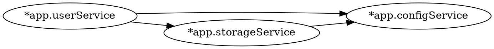

# Dependency Graph

## Overview

Glue can export the dependency graph of a container in [DOT format](https://graphviz.org/doc/info/lang.html) for visualization with Graphviz.

Call `Graph()` on any container to get the DOT output:

```go
ctn, err := glue.New(
    &userService{},
    &configService{},
    &storageService{},
)
if err != nil {
    log.Fatal(err)
}
defer ctn.Close()

fmt.Println(ctn.Graph())
```

## Output Format

The output is a valid DOT digraph:



Beans are identified by their qualifier name when available, otherwise by their type name.

## Rendering

Save the output to a file and render with Graphviz:

```bash
go run ./cmd/myapp -graph > deps.dot
dot -Tpng deps.dot -o deps.png
dot -Tsvg deps.dot -o deps.svg
```

Or pipe directly:

```bash
go run ./cmd/myapp -graph | dot -Tpng -o deps.png
```

## Named Beans

Beans that implement `NamedBean` appear under their qualifier name in the graph:

```go
type cacheService struct {
    glue.NamedBean
}

func (s *cacheService) BeanName() string {
    return "cache"
}
```

This bean appears as `"cache"` in the DOT output instead of `"*app.cacheService"`.

## Factory Beans

Dependencies produced by `FactoryBean` or `ContextFactoryBean` are included in the graph. The edge points from the dependent bean to the factory bean.
